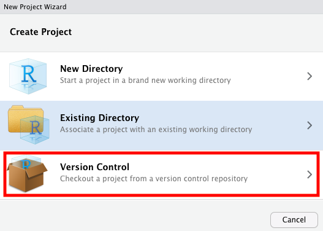
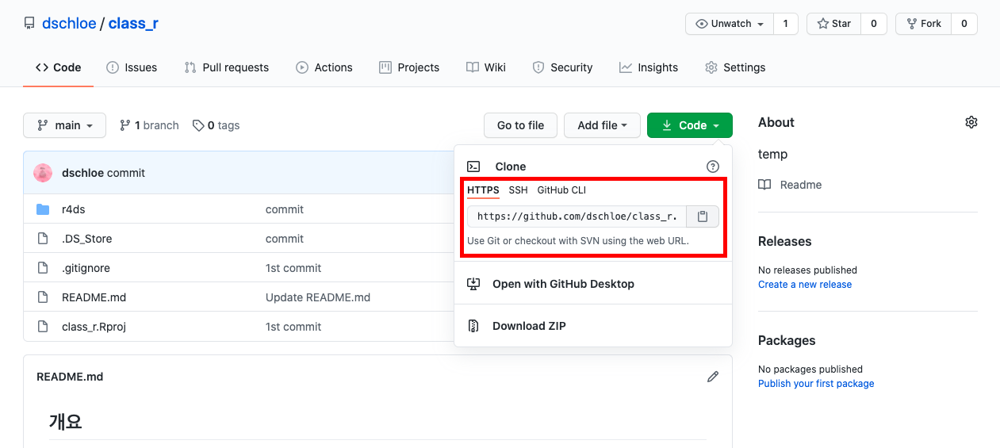
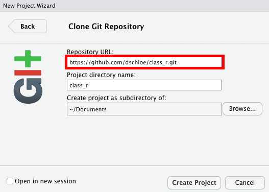

## 개요
- 본 Repo는 강림직업전문학교 수강생을 위해 예시로 작성한 Repo입니다.
- 본 Repo에서는 `R을 활용한 데이터 과학` 발표자료를 공유하기 위해 만들어졌습니다. 
- 참여인원: 12명
- 발표기간: 10월 5일 ~ 10월 14일

## Git & Github 
- 우선 `Git`을 설치합니다. 
  + 싸이트: https://git-scm.com/
  + 설정은 모두 기본 값으로 해주시기 바랍니다. 
- Terimnal 창에서 `git`을 실행하여 정상적으로 설치되었는지 유무를 확인합니다.
- 그 다음은 `Github`에 회원가입을 합니다 
  + `저장소`를 만드는 과정은 아래 싸이트를 참조바랍니다. 
    + 싸이트: https://goddaehee.tistory.com/221

- 이제 `RStudio`에서 `프로젝트`를 클릭한 후 아래 화면에서 `Version Control`을 클릭합니다. 



- 그 다음은 `github`에서 주소를 클릭합니다. 



- 복사한 주소를 아래그림과 같이 주소를 붙여 넣습니다. 



- Note 
  + 이 때 주의해야 하는 것은 경로입니다. 초보자들의 경우 바탕화면에 저장소를 설정하시기를 바랍니다. 

## Git Commit
- 3가지 순서를 기억합니다. 
- 첫번째, 파일을 추가합니다. 
```bash
git add .
```
  + `.`은 모든 파일을 의미합니다. 
  + 전체 파일이 아닌 일부 파일만 올리고 싶다면, `git add filename`만 해도 됩니다. 
- 두번째, 커밋 메시지를 남깁니다. 
```bash
git commit -m "your message"
```
  + 추가한 파일에 대한 일종의 메시지를 남깁니다. 
  + 가급적 영어로 작성 바랍니다. 
  + 메시지 작성하는 방법이 있습니다. (참고: [Git commit 메세지 규약 — Conventional Commits](https://medium.com/hashbox/git-commit-%EB%A9%94%EC%84%B8%EC%A7%80-%EA%B7%9C%EC%B9%99-conventional-commits-71710f7f53c))

- 마지막, 파일과 메시지를 `Github Repo` 저장소에 업로드 합니다. 

```bash
git push
```
- 정상적으로 완료된 메시지는 아래와 같습니다. (예)
```
username$ git push
Enumerating objects: 6, done.
Counting objects: 100% (6/6), done.
Delta compression using up to 4 threads
Compressing objects: 100% (5/5), done.
Writing objects: 100% (5/5), 998 bytes | 998.00 KiB/s, done.
Total 5 (delta 1), reused 0 (delta 0), pack-reused 0
remote: Resolving deltas: 100% (1/1), done.
To https://github.com/dschloe/class_r.git
   26aab11..7c22ba0  main -> main
```

### 에러 핸들링
- `git`은 충돌이 나면 수정하기가 매우 골치 아픕니다. 
  + 따라서, 위 순서를 지켜주셔야 합니다. 
- 첫번째 이슈: 로그인
  + 아래 메시지를 확인합니다.
```bash
 *** Please tell me who you are.
Run
  git config --global user.email "you@example.com"
  git config --global user.name "Your Name"
to set your account's default identity.
Omit --global to set the identity only in this repository.
```
- 위 메시지는 `git commit`을 할 때 발생합니다. 
- 위 메시지는 쉽게 말해 로그인을 하라는 뜻입니다. 
  + 두개의 `git config`을 그대로 실행하며 이 때 독자의 깃허브 메일과 아이디를 입력하시면 됩니다. 

- 두번째 이슈: 깃허브 싸이트에서 수정
  + 초보자들은 IDE보다는 웹사이트가 편합니다. 그래서, 웹사이트에서 무언가를 수정하려는 유혹을 매우 자주 받습니다. (이해합니다.)
  + 이 때, 수정하였다면 `반드시` 여러분 환경에서도 똑같이 반영을 해줘야 합니다. 
    * 물론, 대부분 안합니다. 
  + 그리고, `git push`를 시도합니다. 
  + 이 때 아래와 같은 메시지가 출력됩니다. 
```bash
git push 

To https://github.com/yourname/foo.git

 ! [rejected]        master -> master (non-fast-forward)
error: failed to push some refs to 'https://github.com/yourname/foo.git'
hint: Updates were rejected because the tip of your current branch is behind
hint: its remote counterpart. Integrate the remote changes (e.g. hint: 'git pull ...') before pushing again.
hint: See the 'Note about fast-forwards' in 'git push --help' for details.
```

- 이 때, 매우 간단하게 `git pull`을 시도합니다. 
- 그리고 처음부터 `add`, `commit`, `push`를 시도하면 됩니다. 

