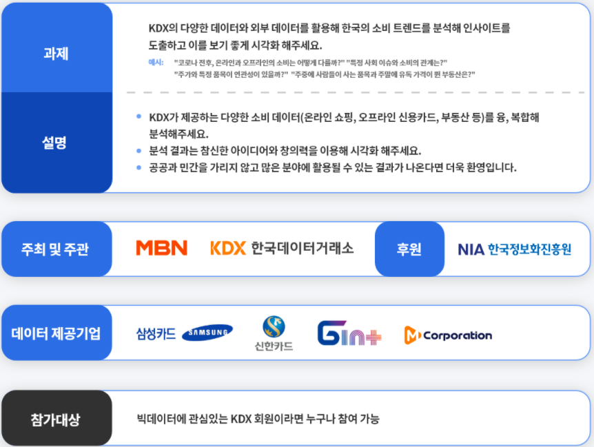
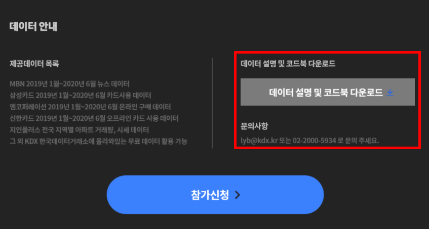

```{r setup, include=FALSE}
knitr::opts_chunk$set(echo = TRUE, warning = FALSE, message = FALSE)
```

## 개요
- 본 수업을 듣는 수강생들을 위해 간단한 튜토리얼을 만들었다. 
- 대회는 다음과 같다. 
  + 싸이트: [한국데이터거래소](http://lab.kdx.kr/adl/contest/main.php?fbclid=IwAR3zy6t2iutLlbxzqZ25AiVOqMuYmFuiFapfjJ246RWGdoMhBKMHYvv-WwQ)





## 1단계 패키지 불러오기
- 데이터 가공 및 시각화 위주의 패키지를 불러온다. 
```{r}
library(tidyverse) # 데이터 가공 및 시각화
library(readxl) # 엑셀파일 불러오기 패키지 
```

## 2단계 데이터 불러오기
- 데이터가 많아서 순차적으로 진행하도록 한다. 
- 각 데이터에 대한 설명은`활용데이터설명(PDF)`을 참조한다. 


- 먼저 제 개발환경은 아래와 같다. 
  + 윈도우와 Mac은 다를 수 있음을 명심하자.
```{r}
sessionInfo()
```

### (1) 삼성카드 데이터 
- 우선 삼성카드 데이터를 불러와서 확인한다. 
- 한글 파일은 인코딩이 늘 항상 문제다. 
  + 파일을 불러오기 전 항상 파일 인코딩을 확인하도록 한다. 
```{r}
readr::guess_encoding("data/Samsungcard.csv", n_max = 100)
```
- Encoding 확인 결과 `EUC-KR`로 확인하였다. 

```{r}
samsung_card <- read_xlsx("data/Samsungcard.xlsx")
samsung_card2 <- read.csv("data/Samsungcard.csv", fileEncoding = "EUC-KR")
```
- 위 두 파일이 동일한 것을 확인해본다

```{r}
head(samsung_card)
head(samsung_card2)
```

- 두 파일이 동일한 것을 확인하였다면 이제 `samsung_card2`는 삭제를 한다. 
  + `RAM`을 아껴 쓰자. 
```{r}
rm(samsung_card2) # 객체 지우는 함수
ls() # 현재 저장된 객체 확인하는 함수
```

### (2) 신한카드 데이터 
- 이번에는 `ShinhanCard.xslx` 데이터를 불러온다. 
```{r}
shinhancard <- read_xlsx("data/Shinhancard.xlsx")
head(shinhancard)
```
- 위 데이터를 불러오니 불필요한 `6:8` 변수가 불러온 것을 확인할 수 있다. 
  + 실제 엑셀 데이터를 열어도 빈값임을 확인할 수 있다. 
  + 따라서, `6:8` 변수는 삭제한다. 
```{r}
shinhancard <- shinhancard %>% 
  select(-c(6:8))

head(shinhancard)
```
### (3) 지인플러스
- 지인플러스는 아파트시세(`GIN00009A`)와 아파트 거래량(`GIN00008B`)을 담은 코드이다. 

```{r}
gin_8a <- read_csv("data/GIN00008A.csv")
gin_9a <- read_csv("data/GIN00009A.csv")
```

- 위 두개의 데이터를 확인해본다. 
```{r}
glimpse(gin_8a)
glimpse(gin_9a)
```
### (4) JSON 파일 불러오기
- `JSON` 파일 불러올 때에는 `jsonlite` 패키지를 활용한다. 
```{r}
library(jsonlite)
GIN_10m <- fromJSON("data/center_GIN00010M.json")
glimpse(GIN_10m)
```
- `PYN_CN`의 값이 조금 다른 것을 확인할 수 있다. 
  + 이 부분은 추후 전처리할 때 정리하는 것으로 확인한다. 

### (5) SSC_Data
- 이번에는 `Mcorporation`내 폴더 데이터를 올리도록 한다. 
- 이번에 파일을 불러올 때는 `readr::read_csv()`를 활용하여 불러온다. 

```{r}
readr::guess_encoding("data/Mcorporation/KDX시각화경진대회_SSC_DATA.csv")
ssc_data <- read_csv("data/Mcorporation/KDX시각화경진대회_SSC_DATA.csv", locale = locale("ko", encoding = "EUC-KR"))
glimpse(ssc_data)
```
### (6) 다중 엑셀파일 불러오기 예제
- `상품 카데고리 데이터_KDX` 시각화 폴더 내 엑셀 데이터를 확인해본다.

```{r}
list.files(path = "data/Mcorporation/상품 카테고리 데이터_KDX 시각화 경진대회 Only/")
```
- 몇가지 파일을 열어본다. 

<br>
- 엑셀 데이터의 변수 등이 동일한 것을 확인할 수 있다. 
- 이제 위 데이터를 한꺼번에 불러와서 하나의 데이터셋으로 합친다. 
- 검색키워드 `Multiple Excel Files import in R`
```{r}
files <- list.files(path = "data/Mcorporation/상품 카테고리 데이터_KDX 시각화 경진대회 Only/", pattern = "*.xlsx", full.names = T)

products <- sapply(files, read_excel, simplify=FALSE) %>% 
  bind_rows(.id = "id") %>% 
  select(-id)

glimpse(products)
```

## 3단계 t-검정
- 통계검정을 간단하게 진행하도록 한다. 
- 수강생들이 진행하는 통계 검정은 `t-검정` 및 `상관 및 회귀분석`으로 진행하기로 하였다. 
- 들어가기에 앞서서.. 
  +  OS 유형별로 차이가 존재할까?
  + t-검정에 해당하는 함수는 무엇일까? 
  + 해석은 어떻게 해야할까?
  + 이론적인 설명은 통계학책을 구매하는 것을 추천한다. 
- 본 포스트에서는 간단한 통계식을 통해 해석하는 것에 중점을 두었다

### (1) 데이터 변환
- 분석의 목적
  + 우선 `IOS`와 `안드로이드`의 구매수와 구매금액의 차이는 존재하는가?
  + 사용데이터: `Mcorporation` 데이터를 확인한다. 
  + `OS유형`과 `구매금액`, 그리고 `구매수`를 변수를 추출하고, `IOS`와 `안드로이드` 기준으로 데이터를 추출한다. 
```{r}
products %>% 
  select(OS유형, 구매금액, 구매수) %>% 
  filter(OS유형 %in% c("IOS", "WINDOWS")) -> df_OS
```


### (2) 등분산 검정
- t-검정을 하기 전에 앞서 두 그룹간의 분산이 동일한지 살펴봅니다. 
```{r}
var.test(구매금액 ~ OS유형, data = df_OS)
```

- `p-value`가 0.05 이상이면 분산이 동일하다고 볼 수 있다. 

### (3) 구매금액에 대한 t-검정
- 이번에는 `t-검정`을 실시한다. 
- 이 때, `var.equal = TRUE`라고 명명한다. 
  + 만약 등분산 검정이 같지 않다면 `var.equal = FALSE`라고 한다.  
```{r}
t.test(구매금액 ~ OS유형, data = df_OS, var.equal = TRUE)
```
- `IOS` 그룹의 구매금액과 `WINDOWS` 그룹의 구매금액은 통계적으로도 큰 차이가 있는 것으로 확인 되었다. 

### (4) All Together
- 이번에는 구매수에 대한 검정을 진행한다.

```{r}
var.test(구매수 ~ OS유형, data = df_OS)
```
- 구매수는 등분산 검정 결과 `P-value`의 값이 `0.05`보다 두 그룹의 분산이 동일하지 않음을 확인하였다. 
- 따라서, `var.equal = FALSE`라고 지정한다. 

```{r}
t.test(구매수 ~ OS유형, data = df_OS, var.equal = FALSE)
```


