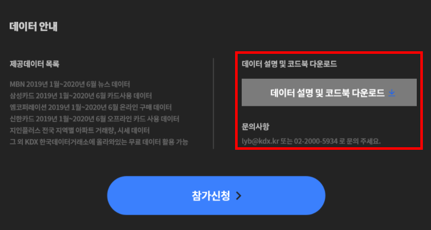

```{r setup, include=FALSE}
knitr::opts_chunk$set(echo = TRUE, warning = FALSE, message = FALSE)
```

## 개요
- 본 수업을 듣는 수강생들을 위해 간단한 튜토리얼을 만들었다. 
- 대회는 다음과 같다. 
  + 싸이트: [한국데이터거래소](http://lab.kdx.kr/adl/contest/main.php?fbclid=IwAR3zy6t2iutLlbxzqZ25AiVOqMuYmFuiFapfjJ246RWGdoMhBKMHYvv-WwQ)


## 1단계 패키지 불러오기
- 데이터 가공 및 시각화 위주의 패키지를 불러온다. 
```{r}
library(tidyverse) # 데이터 가공 및 시각화
library(readxl)
```

## 2단계 데이터 불러오기
- 데이터가 많아서 순차적으로 진행하도록 한다. 
- 각 데이터에 대한 설명은`활용데이터설명(PDF)`을 참조한다. 



### (1) 삼성카드 데이터 
- 우선 삼성카드 데이터를 불러와서 확인한다. 
- 한글 파일은 인코딩이 늘 항상 문제다. 
  + 파일을 불러오기 전 항상 파일 인코딩을 확인하도록 한다. 
```{r}
readr::guess_encoding("data/Samsungcard.csv", n_max = 100)
```
- Encoding 확인 결과 `EUC-KR`로 확인하였다. 

```{r}
samsung_card <- read_xlsx("data/Samsungcard.xlsx")
samsung_card2 <- read.csv("data/Samsungcard.csv", fileEncoding = "EUC-KR")
```
- 위 두 파일이 동일한 것을 확인해본다

```{r}
head(samsung_card)
head(samsung_card2)
```

- 두 파일이 동일한 것을 확인하였다면 이제 `samsung_card2`는 삭제를 한다. 
  + `RAM`을 아껴 쓰자. 
```{r}
rm(samsung_card2) # 객체 지우는 함수
ls() # 현재 저장된 객체 확인하는 함수
```

### (2) 신한카드 데이터 
- 이번에는 `ShinhanCard.xslx` 데이터를 불러온다. 
```{r}
shinhancard <- read_xlsx("data/Shinhancard.xlsx")
head(shinhancard)
```
- 위 데이터를 불러오니 불필요한 `6:8` 변수가 불러온 것을 확인할 수 있다. 
  + 실제 엑셀 데이터를 열어도 빈값임을 확인할 수 있다. 
  + 따라서, `6:8` 변수는 삭제한다. 
```{r}
shinhancard <- shinhancard %>% 
  select(-c(6:8))

head(shinhancard)
```
### (3) 지인플러스
- 지인플러스는 아파트시세(`GIN00009A`)와 아파트 거래량(`GIN00008B`)을 담은 코드이다. 

```{r}
gin_8a <- read_csv("data/GIN00008A.csv")
gin_9a <- read_csv("data/GIN00009A.csv")
```

- 위 두개의 데이터를 확인해본다. 
```{r}
glimpse(gin_8a)
glimpse(gin_9a)
```
### (4) JSON 파일 불러오기
- `JSON` 파일 불러올 때에는 `jsonlite` 패키지를 활용한다. 
```{r}
library(jsonlite)
GIN_10m <- fromJSON("data/center_GIN00010M.json")
glimpse(GIN_10m)
```
- `PYN_CN`의 값이 조금 다른 것을 확인할 수 있다. 
  + 이 부분은 추후 전처리할 때 정리하는 것으로 확인한다. 

### (5) SSC_Data
- 이번에는 `Mcorporation`내 폴더 데이터를 올리도록 한다. 


